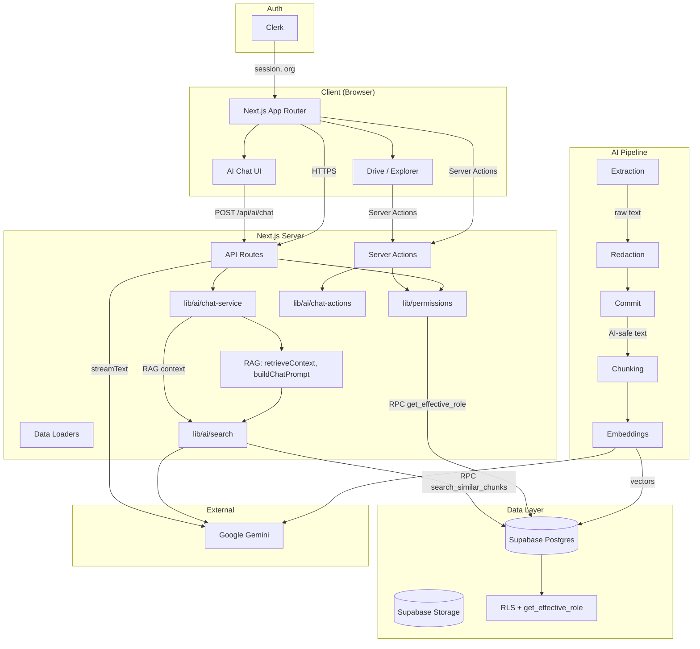
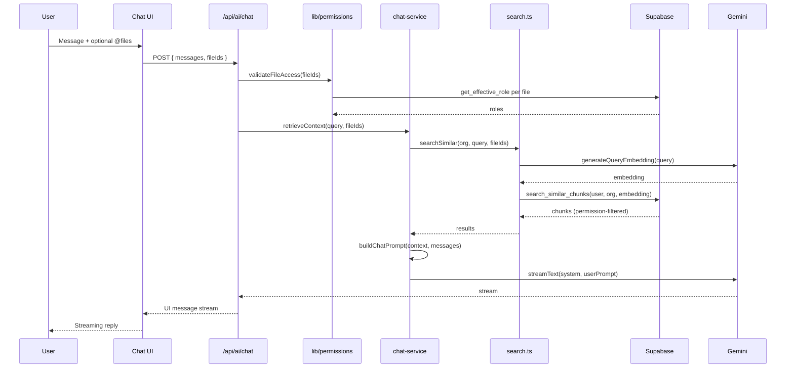

# Berri Space — Project Architecture & Permissions Test Suite

This document provides a comprehensive technical overview of **Berri Space**: a Google Drive–like document management application with team-based access control, folder/file permissions, and an AI assistant that answers questions about documents using RAG. It also describes the **Permission Enforcement Test Suite** in this directory.

---

## Table of Contents

1. [Project Summary](#project-summary)
2. [Tech Stack](#tech-stack)
3. [Project Structure](#project-structure)
4. [System Architecture](#system-architecture)
5. [Permission Model](#permission-model)
6. [Document Processing & Chunking](#document-processing--chunking)
7. [AI / RAG Pipeline](#ai--rag-pipeline)
8. [Permission Test Suite](#permission-test-suite)
9. [Architecture Diagram](#architecture-diagram)

---

## Project Summary

Berri Space is a **document management application** with:

- **Team and role-based access control** (admin, editor, viewer)
- **Folder and file permissions** with inheritance
- **AI assistant** that answers questions about documents via RAG
- **Strict redaction rules**: AI never sees raw or restricted content; redaction is permanent removal, not masking

**Non-negotiable principles:**

1. Backend enforces all permissions; UI is not trusted.
2. Permissions are checked before any data access.
3. AI must never see raw or restricted content.
4. Redaction is permanent removal, not masking.
5. Authorization logic is centralized.
6. All sensitive actions are auditable.

---

## Tech Stack

| Layer | Technology |
|-------|------------|
| **Frontend** | Next.js 16 (App Router), TypeScript, Tailwind CSS, React 19 |
| **Auth** | Clerk |
| **Database** | Supabase Postgres |
| **File storage** | Supabase Storage (S3-compatible) |
| **Vector DB** | Supabase **pgvector** (MVP) |
| **AI** | **Google Gemini** — Embeddings: `gemini-embedding-001`; Chat: **Gemini 2.5 Flash** (`gemini-2.5-flash`) |
| **AI SDK** | Vercel AI SDK (`ai`, `@ai-sdk/google`) + `@google/generative-ai` |
| **Text extraction** | `pdf-parse` (PDF), `mammoth` (DOCX), plain text |
| **Validation** | Zod |

These choices are **locked** and must not change unless explicitly requested.

---

## Project Structure

```
berri-space/
├── app/                          # Next.js App Router
│   ├── admin/                    # Admin views
│   ├── ai/                       # AI chat UI (e.g. /ai/chat/[chatId])
│   ├── api/                      # API routes
│   │   ├── ai/chat/              # Streaming RAG chat (POST)
│   │   ├── context/              # Context API
│   │   ├── permissions/check/    # Permission check endpoint
│   │   ├── search/               # Search API
│   │   └── user/me/              # Current user
│   ├── auth/                     # Clerk auth flows
│   ├── drive/                    # Drive UI (folders, files, recent, shared, trash)
│   ├── settings/                 # User/org settings
│   └── teams/                    # Team management
├── components/                   # React components
│   ├── ai-assistant-panel.tsx    # AI chat sidebar
│   ├── chat-input.tsx            # Chat input + @file mentions
│   ├── file-picker-dropdown.tsx  # @file picker for chat
│   ├── drive-client.tsx          # Drive explorer
│   ├── file-explorer.tsx         # File tree
│   ├── manage-access-modal.tsx   # Permission management
│   └── ui/                       # shadcn/ui primitives
├── hooks/
│   ├── use-chat-stream.ts        # Chat streaming hook
│   └── use-mobile.ts
├── lib/
│   ├── ai/                       # AI foundation
│   │   ├── chunking.ts           # Sentence-aware chunking
│   │   ├── chat-actions.ts       # Server actions (list AI files, conversations)
│   │   ├── chat-service.ts       # RAG retrieval, prompt building
│   │   ├── chat-types.ts         # Chat/RAG types
│   │   ├── embeddings.ts         # Gemini embeddings
│   │   ├── extraction.ts         # PDF/DOCX/text extraction
│   │   ├── pipeline.ts           # Extract → Redact → Index
│   │   ├── redaction.ts          # Redaction application & PII detection
│   │   ├── search.ts             # Similarity search, audit logging
│   │   └── types.ts              # AI types, config, PII patterns
│   ├── auth/                     # Clerk → DB user, org context
│   ├── drive/loaders.ts          # Drive data loaders
│   ├── files/                    # File metadata, storage
│   ├── folders/                  # Folder actions
│   ├── permissions/              # Centralized permission engine
│   │   ├── index.ts              # canUserAccess, getEffectiveRole, assertAccess
│   │   ├── actions.ts            # Server actions (grant/revoke/list)
│   │   └── __tests__/            # Permission test suite (this README)
│   ├── supabase/                 # Supabase client, types
│   └── teams/                    # Team actions
├── supabase/
│   └── migrations/               # Schema, RLS, functions (e.g. get_effective_role, search_similar_chunks)
├── docs/
│   ├── schema.md                 # Database schema
│   └── rls-policies.md           # RLS policies
└── CLAUDE.md                     # Project rules for AI assistants
```

---

## System Architecture

### High-Level Flow

1. **Authentication**: Clerk manages sessions. Server-side code uses `getCurrentUser` / `getCurrentOrganization` (from `lib/auth`) to resolve the internal user UUID and active organization.
2. **Authorization**: All resource access goes through `lib/permissions`. The single entry point is `canUserAccess(userId, resourceType, resourceId, action)`, which calls the Postgres function `get_effective_role`. No inline permission checks; default deny on ambiguity.
3. **Data access**: Supabase Postgres holds orgs, teams, folders, files, permissions, and AI-related tables. Row Level Security (RLS) provides defense-in-depth using `can_view`, `can_edit`, `can_admin`, and org membership.
4. **File storage**: Files live in Supabase Storage. Apps use **signed URLs** only; direct storage URLs are not exposed.
5. **AI**: Documents are extracted → redacted → committed → chunked → embedded. RAG search is org-scoped and permission-filtered. The chat API validates file access, retrieves context, builds prompts, and streams from Gemini 2.5 Flash.

### Key Components

| Component | Responsibility |
|-----------|----------------|
| **Clerk** | SSO, sessions, org context |
| **Supabase Postgres** | Users, orgs, teams, folders, files, `resource_permissions`, `document_*`, `document_chunks`, `ai_query_log` |
| **Supabase Storage** | File binaries |
| **pgvector** | Embeddings in `document_chunks`; similarity via `search_similar_chunks` |
| **Next.js API routes** | Auth, permissions, RAG chat, search |
| **Server actions** | Permission management, chat history, AI-ready file listing |

### Database Layer

- **Organizations** → **organization_members** (super_admin, member)  
- **Teams** → **team_members**  
- **Folders** (hierarchical, `owner_team_id`) → **Files** (in folders or root)  
- **resource_permissions**: polymorphic grants/denies on folders or files for users or teams  
- **document_processing**, **document_raw_text**, **document_redactions**, **document_ai_text**, **document_chunks**: AI pipeline state and data  
- **ai_query_log**: Audit log for AI searches (super_admin only)  
- **audit_logs**: General audit trail for sensitive actions  

RLS is enabled on relevant tables. `get_current_user_id()` maps Clerk’s `auth.uid()` to the internal user UUID. Backend processing uses the **service role** to bypass RLS where required.

---

## Permission Model

### Entities and Roles

- **Users**, **Teams**, **Organizations**  
- **Resource roles**: `admin` > `editor` > `viewer`  
- **Org roles**: `super_admin`, `member`  

### Rules

- Users belong to multiple teams; permissions can be granted to users or teams.
- Folder permissions **inherit** to contained files unless inheritance is broken.
- **Deny always wins** over any grant.
- Only **admins** manage permissions and redactions.
- **Super-admin** has no implicit resource access except for **orphaned** resources (no owner team).

### Centralized Engine (`lib/permissions`)

- **`canUserAccess(userId, resourceType, resourceId, action)`**: Main check. Uses `get_effective_role` RPC and action→role mapping.
- **`getEffectiveRole`**: Wraps DB `get_effective_role(user_id, resource_type, resource_id)`.
- **`assertAccess`**: Same as `canUserAccess` but throws `PermissionError` on deny.
- **`canUserRestore`**: Special-case for restoring deleted resources (owner team or super_admin).
- **`canGrantRole`**, **`canCreateDeny`**, **`canRevokePermission`**: Grant/deny/revoke validation.

**Folder actions** (e.g. `view`, `list`, `create_subfolder`, `upload_file`, `rename`, `move`, `delete`, `restore`, `grant_access`, …) and **file actions** (e.g. `view`, `download`, `ask_ai`, `create_redaction`, …) are mapped to minimum roles. Unknown actions **deny by default**.

---

## Document Processing & Chunking

### Pipeline Overview

The AI pipeline has three main phases:

1. **Extraction** (`processExtraction`): File → raw text. Supported: PDF (`pdf-parse`), DOCX (`mammoth`), plain text. Raw text is stored in `document_raw_text`. **Never** used by AI.
2. **Redaction & commit** (`commitRedactions`): Admin defines redactions (manual, regex, PII patterns). On **commit**, redactions are applied (permanent removal), AI-safe text is stored in `document_ai_text`, and **raw text is deleted**. Redactions become immutable.
3. **Indexing** (`indexDocument`): AI-safe text only. Chunk → embed → store in `document_chunks`.

### Chunking (`lib/ai/chunking.ts`)

Chunking is **sentence-aware** and operates only on **AI-safe** (post-redaction) text.

**Parameters:**

| Constant | Value | Purpose |
|----------|-------|---------|
| `TARGET_CHUNK_SIZE` | 800 | Target chunk size in characters |
| `MIN_CHUNK_SIZE` | 100 | Chunks below this (trailing) are discarded |
| `MAX_CHUNK_SIZE` | 2000 | Hard cap for very long sentences |

**Algorithm:**

1. Start at position 0.
2. Advance to ~800 characters (target).
3. Find the **next** full stop (`.`) after the target; end chunk there (avoids cutting sentences).
4. Optionally include trailing whitespace after the period.
5. Find the **last** sentence boundary inside the current chunk (search in last ~60%).
6. **Next chunk starts** at that sentence start → **overlap** for context.
7. Repeat until end of text. Trailing chunks &lt; 100 chars are dropped (unless it’s the only chunk).

**Fallbacks** when no period is found within `MAX_CHUNK_SIZE`: paragraph break (`\n\n`), then line break (`\n`), then space.

**Output:** `TextChunk[]` with `index`, `content`, `characterStart`, `characterEnd`. Helpers: `validateChunks`, `estimateChunkCount`, `findChunkForPosition`, `findChunksInRange`.

---

## AI / RAG Pipeline

### RAG Flow

1. **User input**: User asks a question in chat. Optional **@file** mentions restrict context to those files.
2. **Permission check**: All mentioned files are checked via `validateFileAccess` → `canUserAccess(..., 'file', fileId, 'view')`.
3. **Context retrieval**:  
   - **Explicit files** (`@file`): `searchSimilar` is called with `fileIds`; only those files are searched.  
   - **No mentions**: Search **all** documents the user can view in the org.
4. **Prompt building**:  
   - If **document context** exists: system prompt instructs “answer only from provided excerpts”; user prompt = excerpts + question.  
   - If **no context**: General-knowledge fallback with a clear “no document context” disclaimer.
5. **LLM**: Gemini 2.5 Flash streams the reply (Vercel AI SDK `streamText` → `toUIMessageStreamResponse`).
6. **Client**: `useChat` + `DefaultChatTransport` consume the stream.

### Search and Security

- **`searchSimilar`** (`lib/ai/search.ts`): Ensures user is org member, generates query embedding via `generateQueryEmbedding` (Gemini), calls **`search_similar_chunks`** RPC.
- **`search_similar_chunks`** (Postgres):  
  - Enforces **org isolation** (`organization_id`).  
  - Only **indexed** documents.  
  - Uses **`can_view(user_id, 'file', file_id)`** so only permitted files are searched.  
  - Returns chunk id, file id, file name, chunk index, content, similarity (cosine).  
- Results are **post-filtered** by `fileIds` when in explicit-files mode.
- Each search is **audited** in `ai_query_log` (service role).

### Embeddings

- **Model**: `gemini-embedding-001`.  
- **Dimensions**: 1536 (matches `document_chunks.embedding`).  
- **Usage**: `RETRIEVAL_DOCUMENT` for chunks; same config for query embedding.  
- **Batching**: Configurable `batchSize` (default 100) for chunk embedding.

### Chat Persistence

- **`chat_conversations`**: Per user, per org; title, timestamps.  
- **`chat_messages`**: Role, content, `mentioned_file_ids`, optional `rag_context`.  
- **Server actions**: `listConversationsAction`, `getConversationAction`, `createConversationAction`, `addMessageAction`, `deleteConversationAction`.  
- **List AI-ready files**: `listAiReadyFilesAction` calls RPC `list_accessible_ai_files(user_id, org_id)` to return indexed files the user can view (used for @file picker).  
- **Loaders**: `loadConversation`, `loadConversations` (React `cache`) for SSR.

---

## Permission Test Suite

This directory contains tests for the **centralized permission system**.

### Goals

- `canUserAccess` correctly enforces permissions for all actions.
- API routes use `canUserAccess` / `assertAccess` only (no ad-hoc checks).
- Default deny on ambiguity.
- Permission inheritance behaves as specified.
- Deny overrides grant.
- Role hierarchy (admin > editor > viewer) is enforced.

### Structure

- **`canUserAccess`**: Folder/file actions, inheritance, deny, team ownership, orphaned resources, unknown actions, default deny.
- **`assertAccess`**: Throws `PermissionError` on deny; returns role on allow.
- **`canUserRestore`**: Restore for deleted resources; super_admin for orphaned.
- **API route audit**: Checklist that all routes use the permission module.
- **Role hierarchy**: Admin can do editor/viewer actions; editor can do viewer.
- **Edge cases**: Concurrent permission changes, deep hierarchy, multiple grants (highest wins).

### Running Tests

- **Framework**: Vitest (`permissions.test.ts`).  
- **Setup**: Test DB with full schema, `setupTestData`, `cleanupTestData`.  
- **TODO**: Implement `setupTestData` / `cleanupTestData` and wire test runner.

### Manual Checklist

- [ ] All API routes use `canUserAccess` or `assertAccess`.
- [ ] No inline checks on `organization_members.role` or `owner_team_id`.
- [ ] Folder and file operations go through permission checks.
- [ ] Restore uses `canUserRestore` for deleted resources.
- [ ] Unknown actions → deny.
- [ ] DB errors → deny.

---

## Architecture Diagram



### Data Flow (RAG Chat)



---

## References

- **Project rules**: `CLAUDE.md`  
- **Schema**: `docs/schema.md`  
- **RLS**: `docs/rls-policies.md`  
- **Permissions**: `lib/permissions/CLAUDE.md`, `permissions.md`  
- **AI**: `lib/ai/CLAUDE.md`
